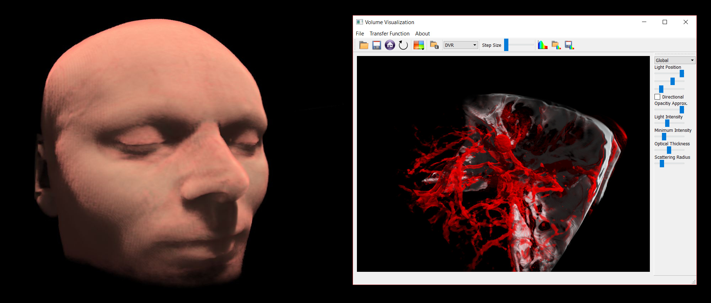

> datasets: MRI Head, Computer Graphics Group; CTA Head with Aneurysm, Division of Neuroradiology, University of Erlangen, Germany

 

# VolumeLighting
This software is a simple renderer for volumetric data - e.g. from CT or MRT scans - with an approximization for global lighting and scattering phenomenons. The only dependencies are [CMake 3.1.1](https://cmake.org/) or newer, [Qt5](https://www.qt.io/) and OpenGL 4.0. It is roughly based on techniques for texture based volume rendering as proposed in:

> *Real-time Volume Graphics*, Engel et. al. 2006 \
> *Acceleration Techniques for GPU-based Volume Rendering*, [Krüger et. al. 2003](http://www.in.tum.de/en/cg/research/publications/2003/acceleration-techniques-for-gpu-based-volume-rendering/ "Krüger et. al. 2003")

The methods for rendering global lighting and multiple scattering are taken from

> *Interactive Global Light Propagation in Direct Volume Rendering using Local Piecewise Integration*, [Hernell et. al. 2008](http://scivis.itn.liu.se/publications/2008/HLY08/ "Hernell et. al. 2008")

### Features
* Direct Volume Rendering and Maximum Intensity Projection
* simple 1D colour and opacity transfer function editor 
* local Phong lighting
* global lighting (single scattering) through shadow volumes
* an approximation for uniformly distributed multiple scattering

### Supported Data Format
Volume data must exist in RAW-format with the following layout:
* One line containing three space separated integer numbers indicating the volumes grid size in X, Y and Z direction respectively.
* One line containing three space separated floating point numbers indicating the volumes size in X, Y and Z dimension respectively.
* The raw volume byte data consisting of unsigned numbers of 1, 2 or 4 bytes size per grid cell e.g.:

> 456 300 488 \
> 0.7 1 0.7 \
> [byte data]

Public volume datasets can be found, for example, on https://klacansky.com/open-scivis-datasets/
